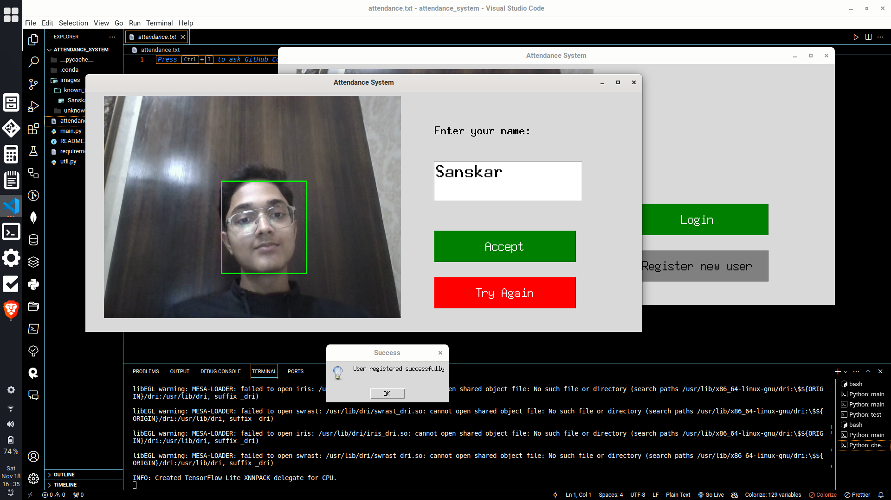
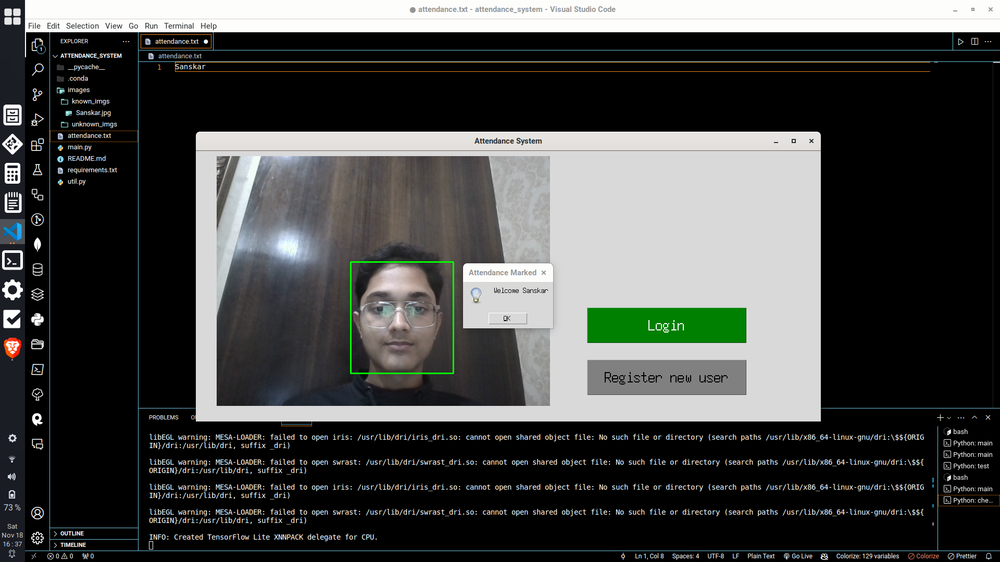

# Attendance System Project Readme

## Project Overview:

This project is an Attendance System implemented using Python and the Tkinter library for the graphical user interface. The system utilizes face detection with the MediaPipe library and facial recognition through the face_recognition library. The main features include user login, registration of new users, and marking attendance.

 

## Project Structure:

- **main.py**: The main script containing the `App` class, which initializes the Tkinter GUI and handles webcam processing, face detection, and user interactions such as login and registration.

- **util.py**: A utility script containing functions to create various Tkinter elements such as buttons, labels, and entry fields. It also includes a messagebox function for displaying information to the user.

## Installation:

1. Clone the repository:

   ```bash
   git clone https://github.com/sanskarmodi8/face_recognition_attendance_system.git
   ```

2. Install the required libraries:

   ```bash
   pip install -r requirements.txt
   ```

3. Run the `main.py` script:

   ```bash
   python main.py
   ```

## Usage:

1. Upon running the script, the main window of the Attendance System will appear.

2. Click the "Login" button to perform facial recognition on the captured webcam image. The system will check for known users and mark attendance if recognized.

3. Click the "Register new user" button to open a new window for user registration. Enter the user's name and click "Accept" to capture an image and register the user.

## Project Notes:

- The project uses MediaPipe for face detection and face_recognition for facial recognition. Ensure that you have a working webcam for the system to capture images.

- The attendance information is stored in the `attendance.txt` file.

- The liveliness check is currently a placeholder (`check_liveliness` method in `App` class) and always returns `True`.

## Future Improvements:

- Implement a robust liveliness check to enhance security.

- Improve the user interface for a more user-friendly experience.

- Add error handling and logging for better debugging.

## Contributing:

Contributions are welcome! If you find any issues or have suggestions for improvements, feel free to open an issue or create a pull request.

## Author:

Sanskar Modi

